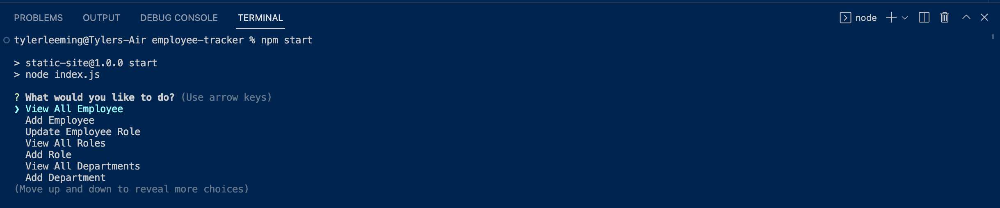

# employee-tracker

## Description
This is a command line application. This allows a business owner to manage departments and employees within their company.

## User Story

### AS A business owner
* I WANT to be able to view and manage the departments, roles, and employees in my company
* SO THAT I can organize and plan my business

## Problems Solved
The larger a company becomes the more complex its structure becomes. Managing and tracking multiple departments each with many employees and a variety of different roles becomes a challenge. This is an application that helps to organise such a business by meeting the following acceptance criteria:

* GIVEN a command-line application that accepts user input
* WHEN I start the application
* THEN I am presented with the following options: view all departments, view all roles, view all employees, add a department, add a role, add an employee, and update an employee role
* WHEN I choose to view all departments
* THEN I am presented with a formatted table showing department names and department ids
* WHEN I choose to view all roles
* THEN I am presented with the job title, role id, the department that role belongs to, and the salary for that role
* WHEN I choose to view all employees
* THEN I am presented with a formatted table showing employee data, including employee ids, first names, last names, job titles, departments, salaries, and managers that the employees report to
* WHEN I choose to add a department
* THEN I am prompted to enter the name of the department and that department is added to the database
* WHEN I choose to add a role
* THEN I am prompted to enter the name, salary, and department for the role and that role is added to the database
* WHEN I choose to add an employee
* THEN I am prompted to enter the employee’s first name, last name, role, and manager, and that employee is added to the database
* WHEN I choose to update an employee role
* THEN I am prompted to select an employee to update and their new role and this information is updated in the database

## Usage

The following images show the application in action. This is a link to the video demonstration: https://watch.screencastify.com/v/sCcBvaRUWpUUqfdoQfti

This image shows the start menu:

This image shows the table of all the employees:

 
## Contributors

Tyler Leeming https://github.com/TLeeming15
## Installation

To install dependancies: npm i 

## License

MIT
